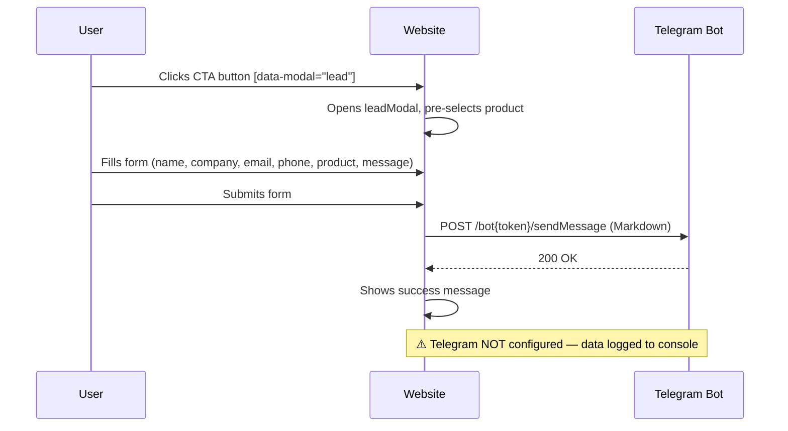
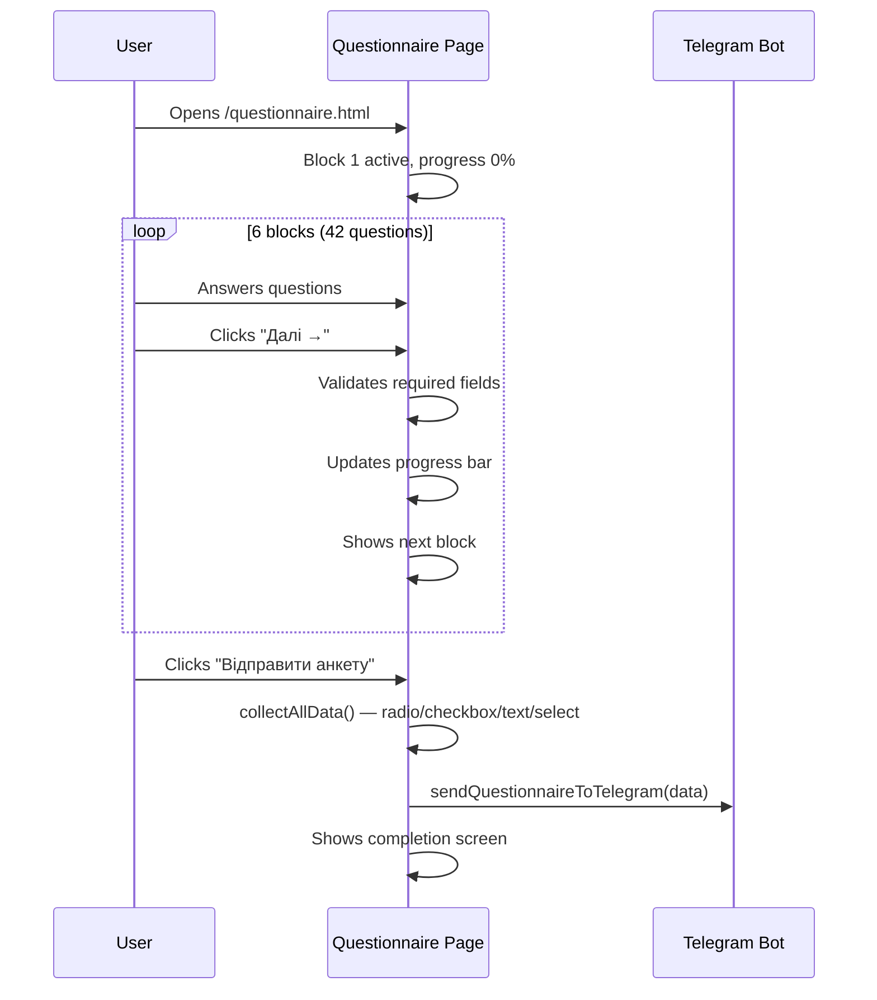
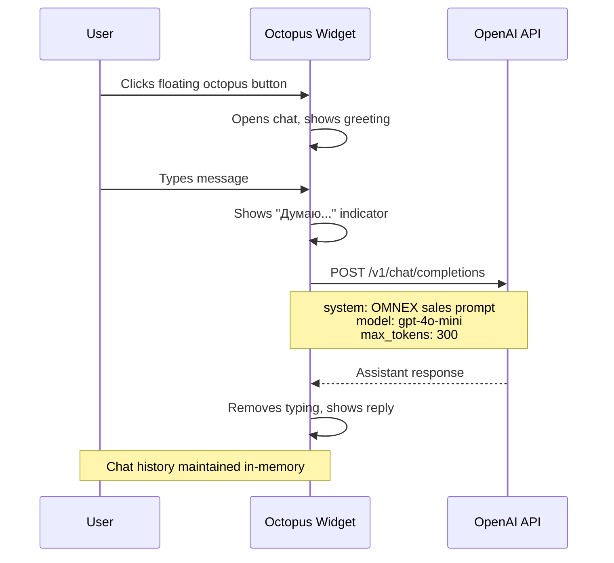
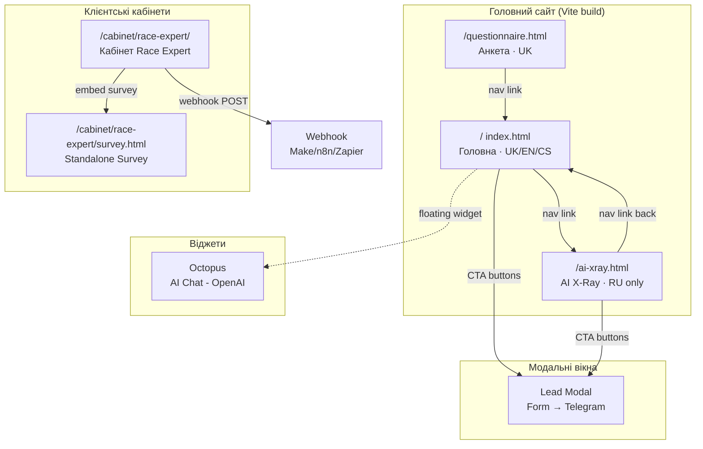

# ARCHITECTURE.md — OMNEX Website

> ⚠️ Цей файл — живий документ (Source of Truth). Оновлюється при кожній архітектурній зміні.
> Останнє оновлення: 2026-04-13 (v2 — Client Cabinets)

## Огляд

**Назва:** OMNEX Website (omnex-website)  
**Тип:** Static Multi-page Website (SPA characteristics)  
**Стек:** HTML + Vanilla CSS + Vanilla JS (ES Modules) + Vite 6.3 (build tool)  
**URL (production):** Vercel (project: `omnex`, ID: `prj_mPVWwTUOtB7Mr26zydgNPgFTh0cr`)  
**Репозиторій:** `https://github.com/ostepeniev/omnex.git`  
**Локальний шлях:** `d:\Antigraviti\OMNEX`  

### Призначення
Корпоративний сайт компанії OMNEX s.r.o. (Чехія) — AI Operations Platform для середнього та великого бізнесу в Центральній та Східній Європі. Сайт презентує продуктову лінійку (AI X-Ray, Pilot, Core, Enterprise), збирає ліди через модальні форми, включає інтерактивну анкету-діагностику для AI X-Ray і AI-чатбот (Octopus) на базі OpenAI.

---

## Інфраструктура

### Deployment
| Компонент | Платформа | Процес | Команда |
|-----------|-----------|--------|---------|
| Website   | **Vercel** | Auto-deploy on push | `git push origin main` → auto-build |
| Dev server | Localhost:3000 | Vite dev server | `npm run dev` |
| Build | Vite | Static build | `npm run build` → `dist/` |
| Preview | Vite | Local preview | `npm run preview` |

### Deploy Pipeline
```
git push origin main
    ↓
GitHub → Vercel (auto-detect Vite)
    ↓
vite build → dist/
    ↓
Vercel CDN (production)
```

**Vercel Project:**
- Project ID: `prj_mPVWwTUOtB7Mr26zydgNPgFTh0cr`
- Org ID: `team_0CesaXUHAzvvIwHLdi9XmNnG`
- Project Name: `omnex`

### Домени
| Домен | Що обслуговує | SSL |
|-------|---------------|-----|
| `omnex-six.vercel.app` | Повний сайт (production) | Vercel auto SSL |

### ENV змінні
| Змінна | Файл | Опис |
|--------|------|------|
| `VITE_OPENAI_API_KEY` | `.env.local` | OpenAI API key для Octopus чатбота (gpt-4o-mini) |

> ⚠️ `.env.local` в `.gitignore` — НЕ комітиться. На Vercel — Environment Variables.

---

## Архітектура

### Структура файлів
```
OMNEX/
├── index.html              # 🏠 Головна сторінка (757 рядків)
├── ai-xray.html            # 📊 AI X-Ray продуктова сторінка (495 рядків)
├── questionnaire.html      # 📝 Анкета-діагностика (670 рядків)
├── cabinet/                # 👤 Клієнтські кабінети (шаблонна структура)
│   └── race-expert/        # ── Кабінет Race Expert (перший клієнт)
│       ├── index.html      # 🏗 Кабінет клієнта (874 рядків, standalone, emoji-based)
│       └── survey.html     # 📋 Брифінг-опитування (377 рядків, 21 питання, standalone)
├── js/
│   ├── main.js             # ⚙️ Core JS: nav, tabs, calc, modal, particles, init (389 рядків)
│   ├── i18n.js             # 🌐 Internationalization engine + dictionary (224 рядків, ~160 ключів)
│   ├── octopus.js          # 🐙 AI Chat Widget (OpenAI integration) (210 рядків)
│   └── questionnaire.js    # 📋 Multi-step form logic (249 рядків)
├── styles/
│   └── main.css            # 🎨 Design System (1370 рядків)
├── prompts/
│   └── octopus_system.md   # 🤖 System prompt для Octopus AI
├── .vercel/                # Vercel project config
├── vite.config.js          # Vite config (multi-page build)
├── package.json            # Dependencies (тільки vite)
├── .env.local              # OpenAI API key (gitignored)
├── .gitignore              # Excluded files
│
│── [Legacy / Reference files — НЕ входять в build]
├── OMNEX_Website.html      # 📦 Стара монолітна версія (1474 рядків, inline CSS+JS, RU)
├── ai_xray_product_full.html  # 📦 AI X-Ray product spec (ChatGPT artifact)
├── AI_XRay_Questionnaire.docx # 📦 Word документ з питаннями
└── questionnaire_raw.md    # 📦 Raw markdown анкети (gitignored)
```

### Vite Build Config
```js
// vite.config.js — Multi-page Application
rollupOptions: {
  input: {
    main: 'index.html',
    xray: 'ai-xray.html',
    questionnaire: 'questionnaire.html',
    // Client Cabinets (додавати нових клієнтів сюди)
    'cabinet-race-expert': 'cabinet/race-expert/index.html',
    'cabinet-race-expert-survey': 'cabinet/race-expert/survey.html',
  }
}
// Dev: port 3000, auto-open
```

---

## 📄 Сторінки (3 + кабінети)

### 1. `/` — Головна сторінка (`index.html`)
**Мова:** `uk` (українська за замовчуванням)  
**i18n:** ✅ (UK/EN/CS через `data-i18n` атрибути)  
**Секції:**
| # | ID | Секція | Ключові елементи |
|---|----|--------|------------------|
| 1 | `mainNav` | Навігація | Logo SVG, nav links, lang switcher (UK/EN/CS), CTA button, hamburger |
| 2 | — | Mobile Menu | Full-screen overlay |
| 3 | `.hero` | Hero | Particle canvas, animated orbs, agent hub visualization (6 nodes), proof stats (counters), 2 CTA |
| 4 | `.ticker-wrap` | Ticker | Auto-scrolling marquee (8 items, duplicated) |
| 5 | — | Problem | 4 problem cards з розрахунком втрат в € |
| 6 | — | Stats | 4 stat blocks (63%, €3.2K, 21×, 8×) з animated counters |
| 7 | `#approach` | Approach | 4-step journey (X-Ray → Pilot → Core → Scale) |
| 8 | `#products` | Products | Tab system (4 tabs: X-Ray, Pilot, Core, Enterprise) |
| 8a | `#tab-xray` | — AI X-Ray tab | Price (€390), features, ROI Calculator (3 sliders) |
| 8b | `#tab-pilot` | — Pilot tab | Price (€2,490), agent list demo |
| 8c | `#tab-core` | — Core tab | Price (€990/міс), mini dashboard demo |
| 8d | `#tab-enterprise` | — Enterprise tab | Custom pricing, capability cards |
| 9 | — | Interactive Demo | Browser mockup з sidebar nav (4 panels: Overview, Agents, Savings, Leads) |
| 10 | `#cases` | Cases | 4 case study cards (Гостинність, B2B, Нерухомість, E-commerce) |
| 11 | `#cta` | CTA | Final conversion block |
| 12 | `#faq` | FAQ | 6 accordion items |
| 13 | `footer` | Footer | 4-column grid, links, contacts (hello@omnex.eu, LinkedIn, Telegram) |
| 14 | `#leadModal` | Lead Modal | Form: name, company, email, phone, product select, message → Telegram |

### 2. `/ai-xray.html` — AI X-Ray Product Page
**Мова:** `ru` ⚠️ (НЕ перекладено на UK, немає i18n, немає lang switcher)  
**i18n:** ❌  
**Секції:**
| # | Секція | Опис |
|---|--------|------|
| 1 | Nav | Спрощена навігація (посилання на `/#approach`, `/#products` тощо) |
| 2 | Hero | Price card (€390 vs ~~€2,500~~), proof stats |
| 3 | Why X-Ray | 3 value prop cards |
| 4 | Report Structure | 6 report blocks (structure of 20-page report) |
| 5 | Process | 5-step timeline (payment → questionnaire → AI → analyst → delivery) |
| 6 | Value Comparison | Price comparison table (McKinsey, Agency, Consultant vs OMNEX) |
| 7 | Objections | 4 FAQ cards addressing doubts |
| 8 | Data Sources | What client provides vs What AI analyzes |
| 9 | Next Steps | Customer journey funnel (X-Ray → Pilot → Core) |
| 10 | CTA | Final conversion |
| 11 | Footer | Same as index |
| 12 | Lead Modal | Same form as index |

### 3. `/questionnaire.html` — AI X-Ray Questionnaire
**Мова:** `uk` (українська)  
**i18n:** Часткова (lang switcher є, але питання НЕ перекладені)  
**Секції:**
| # | Block | Кількість питань | Тема |
|---|-------|-----------------|------|
| 1 | Block 1 | Q1–Q7 | Про компанію (назва, галузь, вік, оборот, країна, бізнес-модель) |
| 2 | Block 2 | Q8–Q14 | Команда і структура (розмір, відділи, IT, робочий час, ФОП) |
| 3 | Block 3 | Q15–Q23 | Операції та процеси (ключові процеси, ручні задачі, рутина, заявки, звіти) |
| 4 | Block 4 | Q24–Q28 | Продажі та клієнти (джерела лідів, конверсія, follow-up) |
| 5 | Block 5 | Q31–Q35a | Поточні інструменти (CRM, автоматизація, AI досвід) |
| 6 | Block 6 | Q37–Q42 | Болі та пріоритети (цілі, проблеми, бюджет, контакт) |

**Типи відповідей:** text, textarea, radio, checkbox, rating-matrix, contact  
**Фічі:** Progress bar, block navigation, validation (required fields), conditional logic (`data-show-if`), submit → Telegram  

---

## 👤 Клієнтські кабінети

> **Шаблон:** Для створення нового кабінету — копіювати `cabinet/race-expert/` → `cabinet/<client-slug>/`,
> змінити `CLIENT_DATA`, `QS`, `BLOCKS`, `WEBHOOK_URL` і додати entry в `vite.config.js`.

### Структура кабінету (на прикладі Race Expert)

**URL Кабінету:** `/cabinet/race-expert/`  
**URL Опитування:** `/cabinet/race-expert/survey.html`  
**Стек:** Standalone HTML (inline CSS + JS), Rajdhani + Inter fonts  
**Design:** Dark theme (#070910), mobile-first, PWA-ready (apple-mobile-web-app)  
**Сховище:** `localStorage` (token, answers, docs, notes)  

#### 4a. `/cabinet/race-expert/index.html` — Кабінет клієнта
**Екрани (Bottom Tabs):**
| Tab | ID | Секція | Опис |
|-----|----|--------|------|
| 🏠 Огляд | `page-overview` | Welcome + KPI + Timeline | Привітання, етап 1/4, banner "Пройти брифінг", timeline (4 кроки) |
| 📋 Брифінг | `page-briefing` | Survey embed | Стан: Not started → Click → Opens survey → Done → Shows answers |
| 📁 Документи | `page-docs` | File upload + Notes | Upload (PDF/DOCX/XLSX/PNG), нотатки |
| 📊 Статус | `page-status` | Project info | Компанія, тип проєкту, токен, контакти (Telegram/Email) |

**Embed Survey:** Вбудований опитувальник (той самий що і standalone) відкривається як full-screen overlay всередині кабінету.

**Конфігурація клієнта:**
```js
CLIENT_DATA = {
  name: 'Race Expert',
  initials: 'RE',
  company: 'Race Expert',
  token: '', // auto-generated tok_xxxx
};
WEBHOOK_URL = ''; // Make.com / n8n / Zapier
```

**URL параметри:** `?token=xxx&name=Client+Name` — персоналізація кабінету через URL.

**Survey (вбудований, 21 питання, 6 блоків):**
| # | Block | Кількість | Тема |
|---|-------|-----------|------|
| 1 | b1 — 🔥 Головний біль | 3 | Операційні проблеми, пріоритет, ручні рішення CEO |
| 2 | b2 — 🔧 Дані та системи | 6 | CRM/1C, розбіжності, API, частота оновлень, права доступу |
| 3 | b3 — 📦 Замовлення | 4 | Ветеранський спорт, формула прибутку, план-факт, набори |
| 4 | b4 — 🏭 Склад | 3 | SLA, затримки, Нова Пошта |
| 5 | b5 — 💰 Фінанси | 3 | Звірка оплат, проблемні платежі, щоденний контроль |
| 6 | b6 — 🎯 Очікування | 2 | Критерії успіху, Telegram-звіти |

**Типи питань:** `single` (radio), `multi` (checkbox), `text` (textarea)  
**При завершенні:** Зберігає в localStorage, відправляє на WEBHOOK_URL (JSON), можливість завантажити `.md` файл відповідей.

#### 4b. `/cabinet/race-expert/survey.html` — Standalone опитування
**Екрани (3 screens з slide transition):**
1. **Intro** — Брендінг RACE EXPERT, анімація бігуна 🏃, статистика (21 питань, ~5 хвилин, AI Аналіз), кнопка "Почати"
2. **Survey** — Питання з progress bar, block chips, slide animations, dots navigation
3. **Thank You** — 🚀, подяка, 3 info cards (AI-аналітика, план дашборду, автоматизація)

**Ідентичні питання** як у вбудованому survey кабінету (21 питань, ті ж `QS`/`BLOCKS`).

### Створення нового кабінету (інструкція)
```
1. cp -r cabinet/race-expert/ cabinet/<new-client>/
2. Відредагувати CLIENT_DATA в index.html
3. Відредагувати QS[], BLOCKS[] під клієнта
4. Додати в vite.config.js:
   'cabinet-<slug>': resolve(__dirname, 'cabinet/<slug>/index.html'),
   'cabinet-<slug>-survey': resolve(__dirname, 'cabinet/<slug>/survey.html'),
5. git push → auto-deploy
```

---

## 🧩 JavaScript модулі (4 файли)

### `js/main.js` — Core Application
| Функція | Опис |
|---------|------|
| `initNavScroll()` | Sticky nav з blur ефектом при scroll > 60px |
| `initScrollAnimations()` | IntersectionObserver для `.fade-up`, `.fade-in` |
| `animateCounter()` / `initCounters()` | Animated number counters (easeOutCubic) |
| `initProductTabs()` | Tab switching для секції Products |
| `updateCalc()` / `initCalc()` | ROI Calculator (3 sliders → routine cost, savings, annual ROI%) |
| `initDemoPanel()` | Interactive demo sidebar navigation |
| `initFaq()` | FAQ accordion (single open) |
| `initMobileMenu()` | Hamburger menu toggle |
| `initModal()` | Lead capture modal (open/close, product pre-select) |
| `sendToTelegram()` | Send lead form → Telegram Bot API |
| `initSmoothScroll()` | Smooth scroll for `#anchor` links |
| `initParticles()` | Hero background particle system (40 particles, connections) |

**Telegram Integration:**
```js
TELEGRAM_CONFIG = {
  botToken: 'YOUR_BOT_TOKEN',  // ⚠️ НЕ НАЛАШТОВАНО
  chatId: 'YOUR_CHAT_ID',      // ⚠️ НЕ НАЛАШТОВАНО
  threadId: null
}
```
> ⚠️ Telegram bot NOT configured — leads are logged to console only.

### `js/i18n.js` — Internationalization
**Мови:** `uk` (default), `en`, `cs`  
**Механізм:** `data-i18n` (textContent) + `data-i18n-html` (innerHTML)  
**Ключів:** ~160 translation keys  
**Storage:** `localStorage('omnex-lang')`  
**Exports:** `t()`, `setLanguage()`, `getLanguage()`, `applyTranslations()`, `initLanguageSwitcher()`  
**Покриття:**
- ✅ `index.html` — повністю перекладена (UK/EN/CS)
- ❌ `ai-xray.html` — НЕ перекладена (залишилась RU)
- ⚠️ `questionnaire.html` — lang switcher є, питання НЕ перекладені

### `js/octopus.js` — AI Chat Widget
**API:** OpenAI Chat Completions (`gpt-4o-mini`)  
**Model:** gpt-4o-mini, max_tokens: 300, temperature: 0.7  
**Features:**
- Floating animated SVG octopus button (bottom-right)
- Pulse ring animation + tooltip (appears after 3s)
- Chat dialog (header, messages, input)
- System prompt inline (SPIN selling, product knowledge, multilingual)
- Language-reactive placeholder
- Error fallback: "Напишіть нам на hello@omnex.eu"

### `js/questionnaire.js` — Multi-step Form
**Blocks:** 6, **Navigation:** Next/Back buttons  
**Validation:** Required fields check with visual error feedback  
**Conditional logic:** `data-show-if="field=value"` toggles visibility  
**Data collection:** Radio, checkbox, text, textarea, select, contact fields  
**Submit:** `sendQuestionnaireToTelegram()` — ⚠️ NOT configured (same as main.js)  
**Completion:** Success screen with next steps info

---

## 🎨 Design System (`styles/main.css` — 1370 рядків)

### CSS Custom Properties
```css
--bg: #04040A           /* Deep dark background */
--surface: #0C0C18      /* Surface level 1 */
--surface2: #12121F     /* Surface level 2 */
--surface3: #1A1A2C     /* Surface level 3 */
--border: rgba(255,255,255,0.07)   /* Subtle borders */
--border2: rgba(255,255,255,0.14)  /* Accent borders */
--text: #EEE8FF         /* Primary text (lavender white) */
--muted: rgba(238,232,255,0.45)    /* Secondary text */
--faint: rgba(238,232,255,0.2)     /* Tertiary text */
--accent: #C4F135       /* Lime green (primary brand) */
--accent2: #7B61FF      /* Purple (secondary) */
--accent3: #35F1C4      /* Teal/Mint (tertiary) */
--red: #FF4757          /* Error/loss */
--gold: #FFB020         /* Warning/enterprise */
--r: 14px               /* Border radius large */
--rs: 8px               /* Border radius small */
```

### Typography
| Font | Usage | Weight |
|------|-------|--------|
| **Syne** | Headlines, display, prices, logos | 400–800 |
| **DM Sans** | Body text, UI elements | 300–500 |
| **DM Mono** | Labels, stats, code-like elements | 400–500 |

### Key Design Patterns
- **Dark theme** — Deep navy/black backgrounds
- **Glassmorphism** — Nav blur, modal backdrop
- **Gradient accents** — Linear/radial gradients on orbs, CTAs
- **Micro-animations** — `fade-up`, `pulse`, `float`, `rotate-ring`, `ticker`, `fillbar`
- **Responsive** — Breakpoints at 900px and 600px

### Responsive Breakpoints
| Breakpoint | Changes |
|------------|---------|
| `≤900px` | Hero visual hidden, grids → 1col, demo sidebar → horizontal, nav links hidden, hamburger visible |
| `≤600px` | Reduced padding, smaller stats grid |

---

## 🔌 Зовнішні інтеграції

### APIs (вихідні)
| Сервіс | Модуль | Endpoint | Для чого | Статус |
|--------|--------|----------|----------|--------|
| OpenAI | `octopus.js` | `api.openai.com/v1/chat/completions` | Octopus AI chat (gpt-4o-mini) | ✅ Працює |
| Telegram Bot | `main.js`, `questionnaire.js` | `api.telegram.org/bot{token}/sendMessage` | Lead forms + questionnaire submission | ⚠️ НЕ налаштовано |

### Зовнішні ресурси
| Ресурс | Тип | URL |
|--------|-----|-----|
| Google Fonts | CSS | `fonts.googleapis.com` (Syne, DM Sans, DM Mono) |
| LinkedIn | Link | `linkedin.com/in/olegalisio/` |
| Telegram | Link | `t.me/oleg_ssh` |
| Email | Link | `hello@omnex.eu` |

### Зв'язки з іншими проектами
| Проект | Тип зв'язку | Деталі |
|--------|-------------|--------|
| — | — | Ізольований проект, без зв'язків з іншими |

---

## Data Flow

### Lead Capture Flow


### Questionnaire Flow


### Octopus Chat Flow


---

## Скрипти та утиліти

| Скрипт | Команда | Опис |
|--------|---------|------|
| Dev server | `npm run dev` | Vite dev server (port 3000, auto-open) |
| Build | `npm run build` | Production build → `dist/` |
| Preview | `npm run preview` | Preview production build locally |
| Deploy | `git push origin main` | Auto-deploy via Vercel |

---

## Відомі обмеження та технічний борг

- [ ] **Telegram Bot NOT configured** — `TELEGRAM_CONFIG` uses placeholder values. Leads from both forms (main + questionnaire) logged to console only
- [ ] **ai-xray.html NOT translated** — Page remains in Russian, no i18n integration, no lang switcher
- [ ] **questionnaire.html partially translated** — UI in Ukrainian, but no i18n for questions content (UK/EN/CS)
- [ ] **Lead modal text hardcoded in Russian** — Modal title/subtitle/labels in `index.html` lines 709-743 are in Russian, not using i18n
- [ ] **Ticker items in Russian** — Lines 141-156 in `index.html` have Russian text tickers
- [ ] **No form backend** — No email notification, no CRM, no database — only Telegram (when configured)
- [ ] **OpenAI API key in .env.local** — For Octopus widget; exposed to client-side (Vite `VITE_` prefix)
- [ ] **Legacy files not cleaned** — `OMNEX_Website.html`, `ai_xray_product_full.html`, `AI_XRay_Questionnaire.docx` in root
- [ ] **No analytics** — No GA4, GTM, Meta Pixel, or similar tracking
- [ ] **No favicon / OG meta** — No social sharing metadata, no favicon
- [ ] **No error pages** — No 404 page

---

## Навігаційна карта



---

## 📏 ПРАВИЛО ОНОВЛЕННЯ

**ОБОВ'ЯЗКОВО оновити ARCHITECTURE.md коли:**

- ✅ Додається нова HTML-сторінка
- ✅ Додається новий JS-модуль
- ✅ Додається нова секція на сторінку
- ✅ Додається нова зовнішня інтеграція (API, webhook, сервіс)
- ✅ Змінюється структура i18n (нові мови, нові ключі)
- ✅ Змінюється deployment (новий домен, платформа)
- ✅ Додається аналітика або tracking
- ✅ Змінюється Octopus AI (модель, prompt)
- ✅ Підключається Telegram bot (токен, chat ID)

**НЕ потрібно оновлювати коли:**
- ❌ Просто fix бага
- ❌ Зміна стилів / тексту / перекладів
- ❌ Рефакторинг без зміни архітектури
- ❌ Оновлення залежностей

**Формат оновлення:**
В кінці файлу є секція `## Changelog`.
Додавай запис при кожній архітектурній зміні:
```
### YYYY-MM-DD — Короткий опис
- Що додано/змінено
- Файли: `path/to/new/file`
- Зв'язки: нова інтеграція X → Y
```

---

## Changelog

### 2026-04-13 — Initial architecture map
- Створено початковий опис архітектури проекту
- Задокументовано всі 3 сторінки, 4 JS модулі, design system
- Описано data flow для lead capture, questionnaire, Octopus chat
- Зафіксовано технічний борг (telegram, i18n, legacy files)
- Описано deployment pipeline (GitHub → Vercel)

### 2026-04-13 — Client Cabinets system
- Додано систему клієнтських кабінетів: `cabinet/<client-slug>/`
- Перший клієнт: Race Expert (`cabinet/race-expert/`)
  - `index.html` — 4-tab кабінет (Огляд, Брифінг, Документи, Статус)
  - `survey.html` — Standalone 21-питання брифінг з intro/survey/thankyou screens
- Оновлено `vite.config.js` — додано 2 нових entry points
- Видалено оригінальні файли з кореня (`race_expert_cabinet.html`, `race_expert_survey.html`)
- Описано протокол створення нового кабінету (copy → edit → add to vite → deploy)
